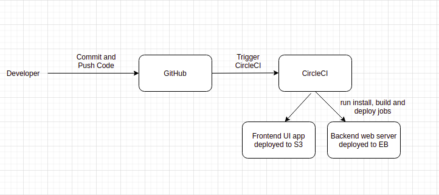

# Pipeline Process
## CI/CD Pipeline Workflow

## Continuous Integration
GitHub is linked to CircleCI and .circleci/config.yml is uploaded in CircleCI project
When developers commit and push code changes to GitHub it internally triggers CircleCI

## Continuous Delivery
The CircleCI pipeline uses orbs to install node, aws cli and eb cli, checkout the code from GitHub repo and run build and deploy jobs by referring the .circleci/config.yml
The frontend Ui app is deployed to S3 using AWS CLI and backend web server is deployed using EB CLI
